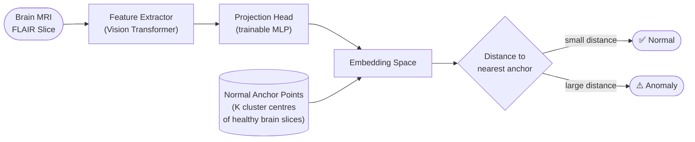
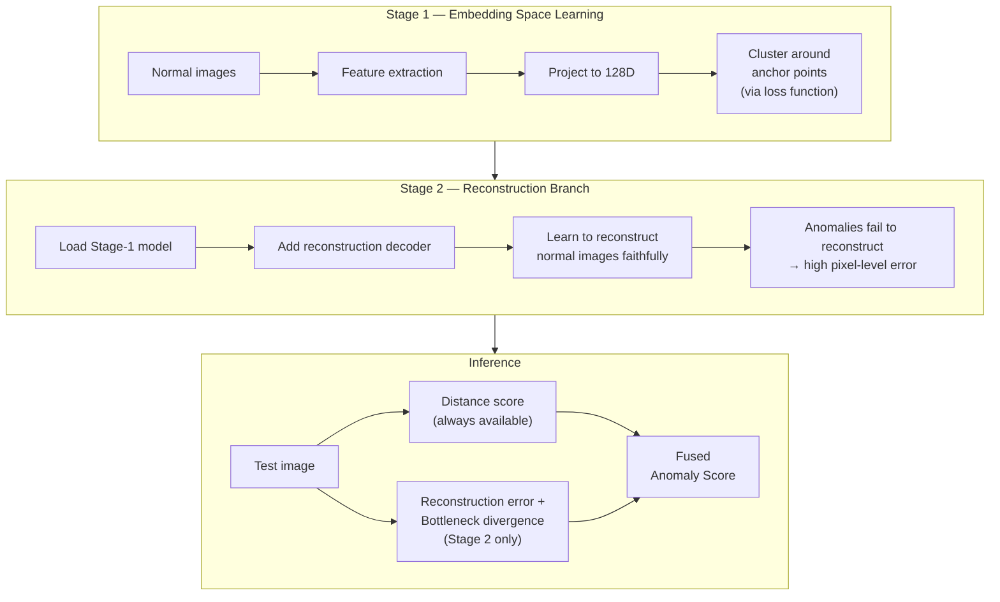
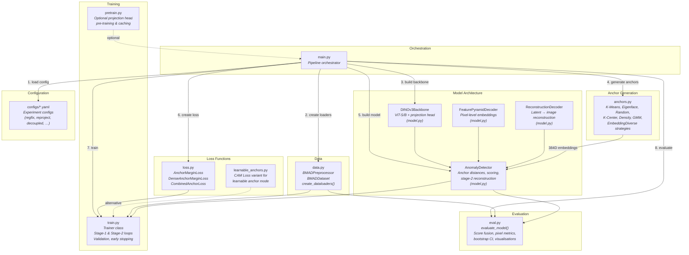
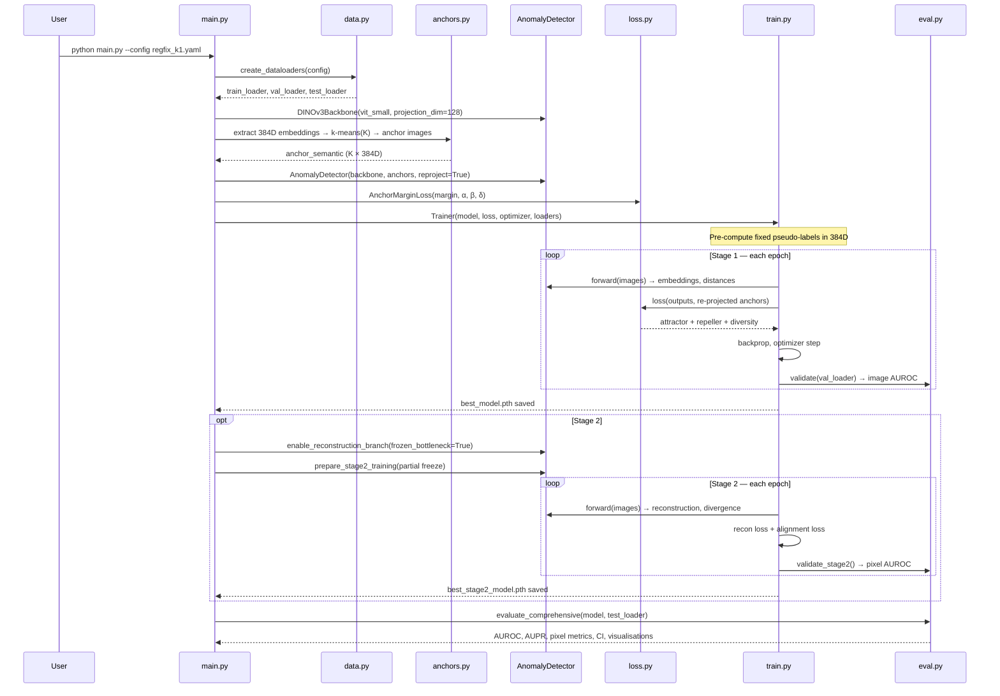
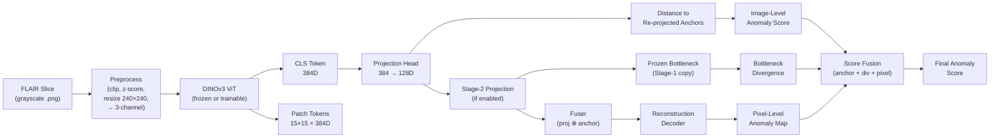

# Architecture Schema

## Overview

This project implements an **anchor-based anomaly detection** system for brain MRI (BraTS2021 FLAIR slices). Normal brain images are mapped into a learned embedding space where they cluster around a set of **anchor points** derived from the training data. At inference, anomalous images (containing tumors) land farther from all anchors, producing higher anomaly scores.

The system is built on a **DINOv3 Vision Transformer** backbone and supports a two-stage training pipeline:

| Stage | Goal | Trainable Components |
|-------|------|---------------------|
| **Stage 1** | Learn an embedding space where normal samples cluster around anchors | Projection head (384→128D), optionally ViT backbone |
| **Stage 2** | Add a reconstruction branch for pixel-level anomaly maps and divergence signals | Stage-2 projection, fuser, reconstruction decoder; optionally last N ViT blocks |

---

## Conceptual Overview

### How the System Works



Anomaly detection is **distance-based**: the model learns an embedding space where all healthy brain images lie close to a set of fixed *anchor points*. In the current reproject pipeline, K-means anchors can be represented either by the **nearest real samples** to the kept centroids or by the **centroids themselves**. A test image is anomalous if its embedding is far from every anchor.

### Two-Stage Architecture



---

## Implementation-Level Component Map

> The diagram below maps each concept to its implementation file. It is useful as a code reference; for a conceptual view see the diagrams above.



---

## Component Roles

### `main.py` — Pipeline Orchestrator

The central entry point that sequences the entire pipeline:

1. Loads a YAML configuration file (seed, data paths, model settings, loss weights, training schedule, stage-2 options, evaluation flags).
2. Creates data loaders via `data.py`.
3. Instantiates the `DINOv3Backbone`.
4. Generates anchors via `anchors.py` / `main.py` (k-means in 384D DINOv3 embedding space, with optional post-clustering pruning of the smallest clusters).
5. Builds the `AnomalyDetector` with the backbone and anchors.
6. Creates the loss function.
7. Runs Stage-1 training (and optionally Stage 2).
8. Runs final evaluation on the held-out test set.

### `data.py` — Data Loading & Preprocessing

| Class / Function | Role |
|-----------------|------|
| `BMADPreprocessor` | Intensity normalization: percentile clipping (0.5–99.5 %), z-score or min-max scaling, resize to 240×240 |
| `BMADDataset` | PyTorch `Dataset` for BraTS2021 FLAIR slices. Loads image + optional mask, converts grayscale → 3-channel, applies augmentations (horizontal flip, shift-scale-rotate) |
| `create_dataloaders()` | Builds train / val / test `DataLoader`s with configurable batch size, workers, and normalization mode (`zscore_only` or `minmax_imagenet`) |

**Directory layout expected:**

```
data/BraTS2021_slice/
├── train/good/          # Normal training images
├── valid/good/          # Normal validation images
├── valid/Ungood/        # Anomalous validation images
├── test/good/           # Normal test images
└── test/Ungood/         # Anomalous test images (+ ground-truth masks)
```

### `model.py` — Model Architecture

#### `DINOv3Backbone`

Wraps a pretrained DINOv3 ViT (Small or Base) from `timm`. Extracts:

- **Global features**: CLS token (384D for ViT-S, 768D for ViT-B).
- **Dense features**: Patch tokens reshaped to spatial grid (15×15 for 240×240 input).
- **Multi-scale features**: Intermediate transformer block outputs for the FPN decoder.

Includes a **trainable projection head** (MLP: 384 → hidden → 128D) that maps embeddings into the anchor distance space.

#### `AnomalyDetector`

The main model class that combines all components:

- Stores **anchor embeddings** (384D semantic anchors from k-means; either nearest-sample exemplars or true centroids, depending on config).
- Computes **distances** between projected sample embeddings and re-projected anchor embeddings.
- Manages the Stage-2 reconstruction branch (stage-2 projection, fuser, decoder, frozen bottleneck).
- Implements `compute_anomaly_scores()` — the inference entry point that produces image-level scores, pixel maps, divergence signals, and the fused output.

**Score production pipeline** (inference path):

```
forward(x)
├── global_distances = L2(proj(CLS), proj(anchors))      # (B, K)
├── reconstruction = decoder(fuser(stage2_feat ⊕ anchor)) # (B, C, H, W)
├── reconstruction_error = MSE(x, reconstruction)          # (B,) — per image
├── bottleneck_divergence = 1 - cos(frozen, stage2)        # (B,) — CLS level
├── patch_divergence_map = 1 - cos(frozen_patch, stage2_patch)  # (B, H, W)
└── reconstruction_pixel_map = (x - recon)²                # (B, H, W)

compute_anomaly_scores(x)
├── anchor_score = global_distances.min(dim=K)             # (B,)
├── patch_div_aggregated = top_k_percentile(patch_div_map) # (B,)
├── pixel_aggregated = top_k_percentile(recon_pixel_map)   # (B,)
└── pixel_scores = reconstruction_pixel_map                # (B, H, W)
```

The `forward()` method produces raw signals; `compute_anomaly_scores()` wraps it in `torch.no_grad()` and applies aggregation. Dataset-level normalisation and fusion happen later in `eval.py`.

For K-means runs in embedding space, the anchor pipeline now supports two additional controls:

- **Effective-K pruning**: after the initial K-means pass, the smallest configurable fraction of clusters can be dropped before semantic anchors are finalised.
- **Capacity-constrained fixed pseudo-labeling**: the initial sample-to-anchor labels can enforce a hard maximum occupancy per anchor, computed from the effective K after pruning.

> **"Pixel-level data not available"**: During Stage-1 training/validation, the reconstruction branch does not exist. `compute_anomaly_scores()` produces no `pixel_scores` key, and the evaluation code skips pixel metrics with an informational log. This is expected behaviour, not a bug.

Supports three anchor modes:

| Mode | Description | Config |
|------|-------------|--------|
| **Re-projection** | Anchors re-projected through projection head each forward pass. Backbone optionally trainable. | `reproject_anchors: true` |
| **Decoupled** | Fixed random orthogonal geometric targets (128D); labelling via frozen 384D semantic anchors. Backbone frozen. | `geometric_init: random_orthogonal` |
| **Learnable** | Anchor embeddings are `nn.Parameter`s jointly optimized with projection head via CAM / InfoNCE loss. | `learnable: true` |

#### `FeaturePyramidDecoder`

FPN-style multi-scale decoder that upsamples intermediate ViT features (15×15 → 30 → 60 → 120 → 240) to produce **pixel-level embeddings** at the original image resolution via lateral connections and smoothing convolutions.

#### `ReconstructionDecoder`

Lightweight decoder used in Stage 2. Takes a fused latent vector (projection ⊕ anchor re-projection) and decodes it back to image space through a fully-connected layer followed by four transposed-convolution blocks with progressive upsampling.

### `anchors.py` — Anchor Generation

Generates K reference anchor points from the training data. Strategies include:

| Strategy | Description |
|----------|-------------|
| **K-Means** (default) | K-means clustering in 384D DINOv3 CLS-token space; selects images nearest to each centroid |
| **Eigenface** | PCA projection + k-means in eigenface space |
| **Random** | Uniformly random sample selection (baseline) |
| **K-Center (FPS)** | Farthest-point sampling for maximum coverage |
| **Density-Weighted** | Inverse-density sampling (favour sparse regions) |
| **GMM** | Gaussian Mixture Model clustering |
| **EmbeddingDiverse** | Farthest-point sampling in DINOv3 embedding space |

The key helper `compute_anchor_embeddings()` extracts 384D DINOv3 embeddings for selected anchor images through the frozen backbone.

### `loss.py` — Loss Functions

#### `AnchorMarginLoss` (primary)

$$L = \alpha \cdot L_{\text{attract}} + \beta \cdot L_{\text{repel}} + \gamma \cdot L_{\text{norm}} + \delta \cdot L_{\text{diversity}}$$

| Term | Formula | Purpose |
|------|---------|---------|
| Attractor | $\frac{1}{N}\sum_i \lVert z_i - c_{y_i}\rVert^2$ | Pull each sample toward its assigned anchor |
| Repeller | $\frac{1}{K(K{-}1)}\sum_{j 
eq k}\max(0,\; m - \lVert c_j - c_k\rVert)^2$ | Push anchors apart by at least margin $m$ |
| Min-Norm | $\frac{1}{K}\sum_k \max(0,\; \delta_{\min} - \lVert c_k\rVert)$ | Prevent anchor collapse to origin |
| Diversity | Entropy regularisation over soft anchor assignments | Encourage balanced anchor usage |

#### `DenseAnchorMarginLoss`

Pixel-level variant of the attractor term operating on the FPN decoder's spatial embeddings.

#### `CombinedAnchorLoss`

Weighted sum of the global `AnchorMarginLoss` and `DenseAnchorMarginLoss`.

### `train.py` — Training Loop

The `Trainer` class manages both training stages:

- **Stage 1** (`train_epoch`): forward pass → loss computation → backprop. Supports fixed pseudo-labels (computed once in 384D) with either nearest-anchor or capacity-constrained assignment.
- **Stage 2** (`train_epoch_stage2`): reconstruction + alignment loss. Frozen bottleneck kept in eval mode. Alignment can target either the frozen sample projection or the sample's fixed Stage-1 anchor target.
- **Validation** (`validate` / `validate_stage2`): computes AUROC metrics via `eval.py`. Tracks image AUROC (Stage 1) or pixel-aggregated image AUROC (Stage 2) for early stopping.
- **Checkpointing**: saves `best_model.pth` (Stage 1) and `best_stage2_model.pth` (Stage 2).
- **Visualisation**: periodic t-SNE and PCA plots of training/test embeddings coloured by anchor assignment.

### `eval.py` — Evaluation & Scoring

`evaluate_model()` is the main inference function. It iterates over the test set, collects per-image scores from `model.compute_anomaly_scores()`, then performs dataset-level operations:

| Signal | Description | Available |
|--------|-------------|-----------|
| **Anchor score** | Min Euclidean distance to any re-projected anchor | Always |
| **Reconstruction score** | MSE between input and reconstructed image | Stage 2 |
| **Bottleneck divergence** | Cosine distance: frozen vs. stage-2 projection (CLS) | Stage 2 with frozen bottleneck |
| **Patch divergence** | Per-patch (15×15) divergence, aggregated via top-k percentile | Stage 2 with frozen bottleneck |
| **Pixel aggregation** | Top-k percentile of pixel-level reconstruction errors | Stage 2 |
| **3-signal fusion** | Weighted combination of anchor + divergence + pixel after normalisation | Stage 2 with fusion enabled |

**Score fusion pipeline** (inside `evaluate_model()` → `_norm_fusion()`):

1. **Collect** all per-image signal arrays after test-set iteration.
2. **Select divergence signal**: compare individual AUROCs of CLS-divergence vs. patch-divergence; pick the higher.
3. **Anti-correlation guard**: drop any signal with individual AUROC < 0.5 (set its weight to 0).
4. **Normalise** each surviving signal independently (default: `minmax` across all test samples).
5. **Fuse**: weighted sum with renormalised weights → final fused score array.
6. **Compute metrics**: image-level AUROC/AUPR on fused scores; pixel-level AUROC on flattened pixel maps vs. flattened GT masks.

The pixel-to-image aggregation uses `pixel_aggregation.py:aggregate_pixel_scores_torch()`, which supports five strategies: `top_k_percentile` (default, 95th percentile), `mean`, `max`, `self_normalized`, and `threshold_ratio`.

For a detailed analysis of how score signals behave at different K values, see [SCORING_ANALYSIS.md](SCORING_ANALYSIS.md). For exact formulas, see [PIPELINE.md § 5.6](PIPELINE.md#56-score-computation-details).

Additional outputs: bootstrap confidence intervals, operating-point tables (at target FPR), ROC / score-distribution visualisations, per-image score CSV.

### `pretrain.py` — Projection Head Pre-training (optional)

Addresses temporal misalignment between anchors (projected at $t{=}0$) and samples during training. Pre-trains the projection head for a few epochs with temporary anchors and caches the result. In practice, orthogonal initialisation of the projection head is sufficient and pre-training is typically disabled.

### `learnable_anchors.py` — Learnable Anchor Mode (alternative)

Allows anchor embeddings to be `nn.Parameter`s optimised jointly with the projection head via a CAM loss variant (attractor + repeller + min-norm). Supports both fixed and dynamic pseudo-label assignment.

### `configs/*.yaml` — Experiment Configurations

Each YAML file fully specifies one experiment: seed, data paths, anchor strategy & count, model backbone & projection, loss weights, training schedule, Stage-2 options, and evaluation flags. Key families:

| Config family | Description |
|--------------|-------------|
| `regfix_k{1,512,1024}.yaml` | Trainable backbone, re-projected anchors, Stage 1 |
| `regfix_k{1,512,1024}_stage2.yaml` | Same + Stage-2 reconstruction branch |
| `reproject_k*_early_trainable_backbone.yaml` | Earlier reproject experiments (trainable backbone) |
| `decoupled_k*_{early,noearly}.yaml` | Expert's decoupled approach (fixed geometric targets) |
| `expert_*ep_k*_{early,noearly}.yaml` | Expert approach with varying epoch counts |

---

## Component Interaction Flow

> Implementation-level sequence diagram (maps to source files). For the conceptual end-to-end flow see the Stage diagrams in [PIPELINE.md](PIPELINE.md).



---

## Data Flow Summary


