# Training & Inference Pipeline

This document describes the complete training and inference pipeline, covering data preprocessing, Stage-1 anchor-based training, Stage-2 reconstruction training, inference scoring, and post-processing.

---

## Table of Contents

1. [Data Preprocessing](#1-data-preprocessing)
2. [Anchor Generation](#2-anchor-generation)
3. [Stage 1 — Anchor-Based Training](#3-stage-1--anchor-based-training)
4. [Stage 2 — Reconstruction Training](#4-stage-2--reconstruction-training)
5. [Inference Pipeline](#5-inference-pipeline)
6. [Post-Processing](#6-post-processing)
7. [Anchor Modes (Alternatives)](#7-anchor-modes-alternatives)

---

## 1. Data Preprocessing

Every FLAIR slice passes through the same preprocessing chain before entering the model, both during training and inference.

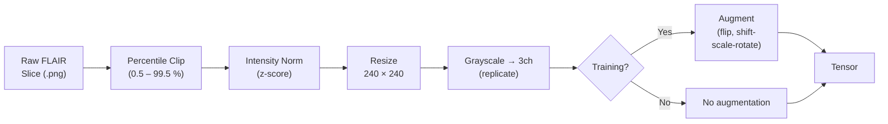

| Step | Detail |
|------|--------|
| **Percentile clipping** | Clips intensity values to the [0.5, 99.5] percentile range to suppress outlier voxels |
| **Z-score normalisation** | Per-image: subtract mean, divide by std. Brings all slices to a comparable intensity distribution (`zscore_only` mode) |
| **Resize** | Bilinear interpolation to 240 × 240 pixels (divisible by ViT patch size 16 → 15 × 15 patches) |
| **3-channel conversion** | The single grayscale channel is replicated three times to match the DINOv3 input format (ImageNet-pretrained) |
| **Augmentation** (training only) | Random horizontal flip + random shift-scale-rotate. Applied _after_ normalisation |
| **ImageNet normalisation** (optional) | When using `minmax_imagenet` mode, values are scaled to [0, 1] and then normalised with ImageNet mean/std. Not used in the latest `regfix` experiments |

**Ground-truth masks** (for anomalous images) are loaded alongside the image and resized to the same spatial dimensions. They are used only during evaluation, never during training.

---

## 2. Anchor Generation

Anchors are reference points in the embedding space that represent canonical "normal" patterns. They are generated **once** before training begins and remain fixed throughout.

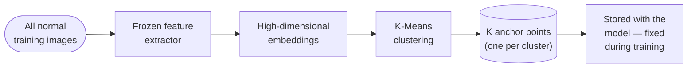

<details>
<summary>Implementation-level diagram</summary>

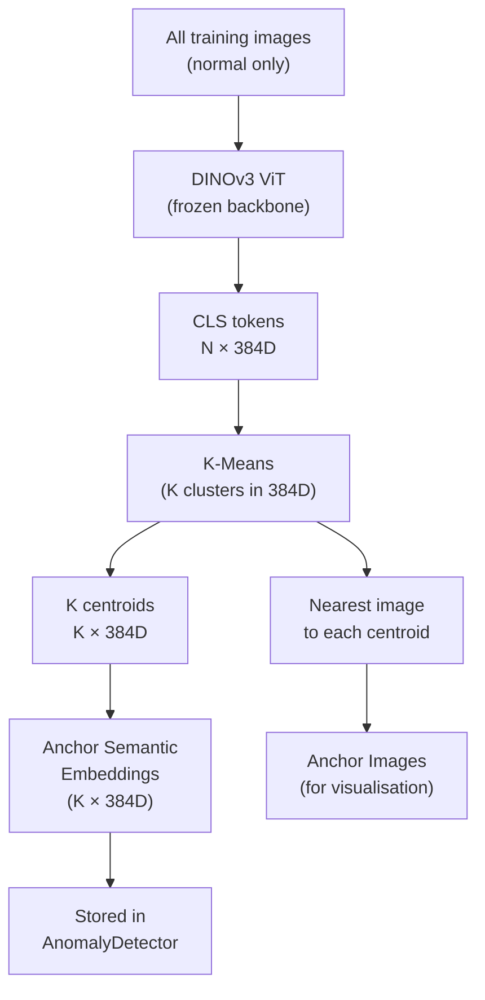

</details>

**Key details:**

- Embeddings are extracted with the **frozen** DINOv3 backbone (before any projection head training).
- The clustering operates in the **raw 384D CLS-token space**, which captures rich semantic features.
- The selected anchor images are those closest (L2) to each k-means centroid — they are real training images, not synthetic.
- The resulting 384D embeddings are stored in the `AnomalyDetector` as `anchor_global_raw` (a fixed buffer, not a learnable parameter).
- Typical K values used in experiments: **K = 1** (single anchor, best image AUROC), **K = 512**, **K = 1024**.

The anchor embeddings and metadata (image paths, cluster assignments) are saved to `anchor_embeddings.pt` in the experiment output directory.

> **Why choose K?** K controls the granularity of the normal data model. A single anchor (K = 1) works well when the training distribution is compact and homogeneous — all normal FLAIR slices are pulled to one point, and any deviation flags an anomaly. Larger K allows the model to capture distinct anatomical modes (e.g. different brain regions or slice positions) without conflating them. In practice K = 1 achieved the best image-level AUROC on BraTS2021, suggesting that normal FLAIR slices form a sufficiently tight cluster that a single prototype is adequate. Larger K risks over-partitioning: each anchor covers fewer samples, making the manifold boundary less well-defined.

---

## 3. Stage 1 — Anchor-Based Training

Stage 1 trains the **projection head** (and optionally the ViT backbone) so that projected normal embeddings cluster tightly around their assigned anchors.

### 3.1 Concept

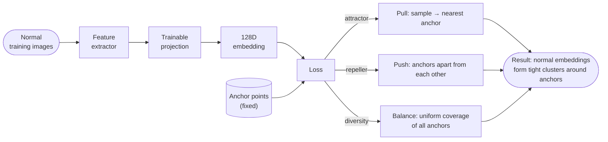

Pseudo-labels (which anchor each image belongs to) are assigned **once** in the raw feature space before training and held fixed — this avoids instability from shifting assignments.

> **Why fix assignments instead of updating them every epoch?** If we re-computed nearest-anchor assignments after every parameter update (dynamic reassignment), the loss landscape would shift constantly — a sample temporarily migrating away from its anchor due to a bad gradient step could trigger a cascading reassignment, creating an unstable feedback loop. Fixing assignments in the semantically rich 384D DINOv3 space (before any projection head training) anchors the optimisation to a stable, meaningful partition of the data. The 384D space is trustworthy from the start because DINOv3 was pretrained at large scale; the 128D projection space, by contrast, is initially random.

### 3.2 Implementation-Level Overview

<details>
<summary>Detailed training loop diagram</summary>

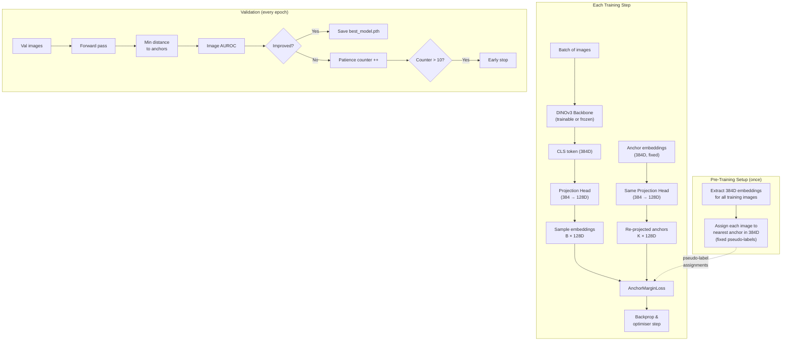

</details>

### 3.3 Fixed Pseudo-Labels

Before training begins, every training image is assigned to its nearest anchor **in the raw 384D DINOv3 space** (not the projected 128D space). This assignment is computed once and remains constant across all epochs.

The rationale: the 384D semantic space provides meaningful, stable cluster assignments before the projection head has been trained. Assigning in the 128D space would use random (untrained) projections, producing meaningless assignments.

### 3.4 Anchor Re-Projection

At every forward pass, the raw 384D anchor embeddings are projected through the **current** projection head to obtain 128D anchor positions:

```
anchor_128d = projection_head(anchor_384d)   # shape: (K, 128)
anchor_128d = L2_normalize(anchor_128d)
```

This means anchor positions in 128D **move** as the projection head is trained — they co-adapt with the sample embeddings. A diversity loss term ($\delta = 0.1$) prevents all anchors from collapsing to the same point.

> **Why re-project anchors instead of fixing them?** Fixing anchors in 128D before training (the "decoupled" approach) avoids moving targets but uses random orthogonal vectors as targets, which are semantically arbitrary. Re-projection lets the anchors adapt with the projection head so that the trained 128D space reflects the semantic clustering established in 384D, rather than random geometry. The downside is that anchors can drift toward one another as training progresses — which is exactly why the repeller and diversity losses are necessary counterweights.

### 3.5 Loss Function

The `AnchorMarginLoss` combines four terms:

$$L_{\text{Stage1}} = \alpha \cdot L_{\text{attract}} + \beta \cdot L_{\text{repel}} + \gamma \cdot L_{\text{norm}} + \delta \cdot L_{\text{diversity}}$$

| Term | Default weight | Effect |
|------|---------------|--------|
| **Attractor** ($\alpha = 1.0$) | Pull each sample toward its pre-assigned anchor: $\frac{1}{N}\sum_i \lVert z_i - c_{y_i}\rVert^2$ |
| **Repeller** ($\beta = 0.5$) | Push anchors apart if closer than margin $m$: $\sum_{j 
eq k}\max(0, m - \lVert c_j - c_k\rVert)^2$ |
| **Min-Norm** ($\gamma = 0.0$) | Prevents anchors from collapsing to origin (only needed for learnable anchors) |
| **Diversity** ($\delta = 0.1$) | Entropy regularisation: encourages uniform assignment distribution across anchors |

**Why do we need both a repeller and a diversity term?** They address two distinct failure modes:

- **Repeller** acts on *anchor positions* in 128D: it ensures that different anchors occupy geometrically separated regions of the projection space, so each forms a distinct attractor well. Without it, multiple anchors can collapse into the same neighbourhood even if the samples assigned to them differ.
- **Diversity** acts on *assignment probabilities*: with re-projection the projection head could learn to funnel all samples toward the single nearest anchor (making the rest effectively unused — "dead anchors"), while still keeping the anchors geometrically separated. Entropy regularisation over soft assignments penalises this imbalance, ensuring every anchor actively participates in the optimisation.

The two losses are complementary: the repeller keeps anchors *spatially spread*; diversity keeps them *evenly used*.

### 3.6 Trainable Components

| Component | Trainable? | Learning Rate |
|-----------|-----------|---------------|
| DINOv3 ViT backbone | Yes (in `regfix` configs) | $10^{-4}$ |
| Projection head (384 → 128D) | Yes | $10^{-4}$ |
| Anchor embeddings | No (fixed buffer) | — |

**Optimiser:** AdamW with weight decay $10^{-4}$. Mixed precision (AMP) enabled.

**Early stopping:** Monitors validation **image AUROC** with patience of 10 epochs. Best checkpoint saved as `best_model.pth`.

### 3.7 Stage-1 Outputs

| Artifact | File | Description |
|----------|------|-------------|
| Best checkpoint | `best_model.pth` | Model weights at best validation AUROC |
| Anchor data | `anchor_embeddings.pt` | 384D anchor embeddings, image paths, cluster metadata |
| Training curves | `training_history.json` | Per-epoch loss components and AUROC |
| Visualisations | `visualizations/train_epoch_*.png` | t-SNE / PCA plots of embeddings coloured by anchor assignment |

---

## 4. Stage 2 — Reconstruction Training

Stage 2 adds a **reconstruction branch** on top of the trained Stage-1 model. Its purpose is to produce **pixel-level anomaly maps** and an additional **bottleneck divergence** signal.

### 4.1 Why Add a Reconstruction Branch?

Stage 1 is effective at flagging images that are globally *far* from any normal anchor. But a brain MRI slice is mostly healthy tissue even when a tumour is present — the tumour may occupy only a small fraction of the image. The global CLS-token embedding can therefore remain close to a normal anchor while a localised anomaly goes undetected.

A reconstruction-based branch addresses this by learning a *per-pixel* notion of normality:

| Problem with Stage 1 alone | How Stage 2 helps |
|---------------------------|-------------------|
| Anchor distance is a single image-level score — it cannot localise *where* the anomaly is | Reconstruction error is spatial: each pixel gets its own anomaly score |
| A small tumour in an otherwise normal slice may not shift the global embedding far enough | The decoder, trained only on normal slices, fails specifically at the anomalous pixels → high local error |
| Only one anomaly signal is available for decision-making | Two complementary signals (distance + reconstruction) can be fused for better coverage |

### 4.2 Concept

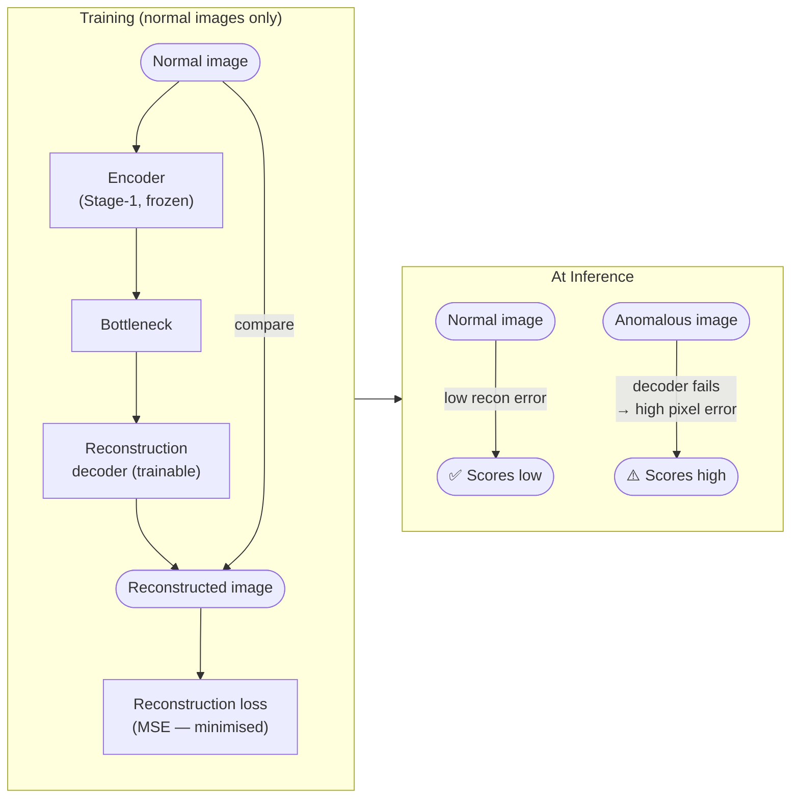

A **frozen copy** of the Stage-1 encoder is also kept as a reference ("frozen bottleneck"). During Stage-2 training the new reconstruction projection adapts to the task; at inference, the *divergence* between the frozen and adapted projections provides a second anomaly signal — anomalies cause larger drift.

> **Why keep a frozen copy at all?** The alignment loss encourages the stage-2 projection to stay close to the frozen one during *training* (stability). But the frozen projection has a second role at *inference*: it is a fixed reference of "what a normal representation looks like in Stage-1 space." For anomalous inputs, the stage-2 projection must deviate from this stable reference to minimise reconstruction loss, producing a measurable divergence. Without the frozen copy, this reference signal would be lost after training.

### 4.3 Implementation-Level Overview

<details>
<summary>Detailed training loop diagram</summary>

```mermaid
flowchart TD
    subgraph "Setup"
        S1["Load best_model.pth<br/>(Stage-1 checkpoint)"] --> S2["enable_reconstruction_branch()"]
        S2 --> S3["Create stage-2 projection,<br/>fuser, decoder"]
        S2 --> S4["Clone Stage-1 projection<br/>→ frozen_projection<br/>(requires_grad = False)"]
        S3 --> S5["prepare_stage2_training()<br/>Freeze encoder / anchors"]
    end

    subgraph "Each Training Step"
        T1["Batch of images"] --> T2["DINOv3 Backbone<br/>(partially trainable)"]
        T2 --> T3["Raw CLS (384D)"]
        T3 --> T4["Stage-2 Projection<br/>(384 → recon_dim)"]
        T3 --> T5["Frozen Projection<br/>(Stage-1 copy, 384 → 128D)"]

        T4 --> T6["Stage-2 feat"]
        T5 --> T7["Frozen feat"]

        G1["Assigned anchor<br/>(re-projected to recon_dim)"] --> T8["Fuser<br/>concat(stage2_feat, anchor)"]
        T6 --> T8
        T8 --> T9["Reconstruction Decoder"]
        T9 --> T10["Reconstructed image"]

        T10 --> L1["Reconstruction Loss<br/>(MSE vs. input)"]
        T6 --> L2["Alignment Loss<br/>(cosine to frozen feat)"]
        L1 --> LT["Total = w_r · L_recon + w_a · L_align"]
        L2 --> LT
        LT --> BP["Backprop"]
    end

    subgraph "Validation"
        V1["Compute all signals:<br/>anchor, recon, divergence,<br/>pixel aggregation"] --> V2["pixel_aggregated_image_auroc"]
        V2 --> V3{"Improved?"}
        V3 -->|Yes| V4["Save best_stage2_model.pth"]
    end
```

</details>

### 4.4 New Components Added in Stage 2

| Component | Architecture | Purpose |
|-----------|-------------|---------|
| **Stage-2 projection** | MLP: 384 → 192 → `recon_dim` | Independent projection for reconstruction bottleneck (can differ from anchor dim) |
| **Frozen projection** | Exact clone of Stage-1 projection head | Provides a frozen reference; divergence between frozen and stage-2 features indicates anomaly |
| **Anchor re-projection** | Linear: 128 → `recon_dim` | Maps anchor-space embeddings into reconstruction space so they can be concatenated with stage-2 features |
| **Stage-2 fuser** | MLP: 2 × `recon_dim` → `recon_dim` | Merges the stage-2 projection with the assigned anchor's re-projected embedding |
| **Reconstruction decoder** | FC → 4 × ConvTranspose2d blocks (progressive upsampling) | Decodes the fused latent back into image space |

### 4.5 Loss Function

$$L_{\text{Stage2}} = w_r \cdot L_{\text{recon}} + w_a \cdot L_{\text{align}}$$

| Term | Default weight | Description |
|------|---------------|-------------|
| **Reconstruction** ($w_r = 1.0$) | MSE between input image and reconstructed image |
| **Alignment** ($w_a = 0.1$) | $1 - \cos(f_{\text{stage2}}, f_{\text{frozen}})$ — keeps stage-2 bottleneck close to stage-1 space |

### 4.6 Trainable Components

| Component | Trainable? | Notes |
|-----------|-----------|-------|
| DINOv3 backbone (first blocks) | Frozen | Preserving Stage-1 representations |
| DINOv3 backbone (last N blocks) | Optionally trainable | `unfreeze_last_n_blocks: 2` at reduced LR (×0.1) |
| Stage-1 projection head | Frozen | Anchor distances remain stable |
| Frozen projection | Frozen | Reference signal, never updated |
| Anchor embeddings | Frozen | Same anchors as Stage 1 |
| Stage-2 projection | **Trainable** | Learns reconstruction-specific features |
| Fuser | **Trainable** | Merges projection + anchor context |
| Reconstruction decoder | **Trainable** | Learns to reconstruct from fused latent |
| Anchor re-projection layer | **Trainable** | Bridges anchor space → recon space |

**Early stopping:** Monitors **`pixel_aggregated_image_auroc`** with patience of 10 epochs. Best checkpoint saved as `best_stage2_model.pth`.

### 4.7 What the Frozen Bottleneck Provides

The frozen projection produces an embedding that reflects the **Stage-1 learned space**. The trainable stage-2 projection, on the other hand, adapts to the reconstruction task. For normal images the two projections remain close (low divergence). For anomalous images — which the reconstruction branch struggles to faithfully reconstruct — the stage-2 features drift from the frozen reference, creating a **bottleneck divergence** signal.

This divergence is measured in two complementary ways:

- **CLS-level** (bottleneck divergence): single scalar per image — cosine distance between frozen and stage-2 global features. Fast and compact, but loses spatial information entirely.
- **Patch-level**: the divergence is computed independently for each of the 15 × 15 = 225 patch tokens, yielding a spatial map that can localise *which part* of the image drove the drift. This map is then aggregated (top-k percentile) to produce an image-level score.

> **Why have both CLS-level and patch-level divergence?** The CLS token summarises the whole image; a small tumour contributes little to this global average and may not produce strong CLS-level divergence. The patch tokens retain spatial resolution, so even a small anomalous patch generates a visible spike in the divergence map. Conversely, the CLS signal is cleaner and less noisy for cases where the anomaly is diffuse or global. Because we do not know in advance which signal will be more discriminative for a given dataset or anomaly type, both are computed and the one with the higher AUROC on the evaluation set is automatically selected for fusion.

### 4.8 Stage-2 Outputs

| Artifact | File | Description |
|----------|------|-------------|
| Best checkpoint | `best_stage2_model.pth` | Model weights at best pixel-aggregated AUROC |
| Pixel statistics | `pixel_stats.json` | Per-pixel residual statistics (mean, std) for threshold-ratio aggregation |

---

## 5. Inference Pipeline

At inference time, the trained model processes each test image and produces one or more anomaly signals. The model to load depends on how many stages were trained.

### 5.1 Concept — How Anomaly Scores Are Produced

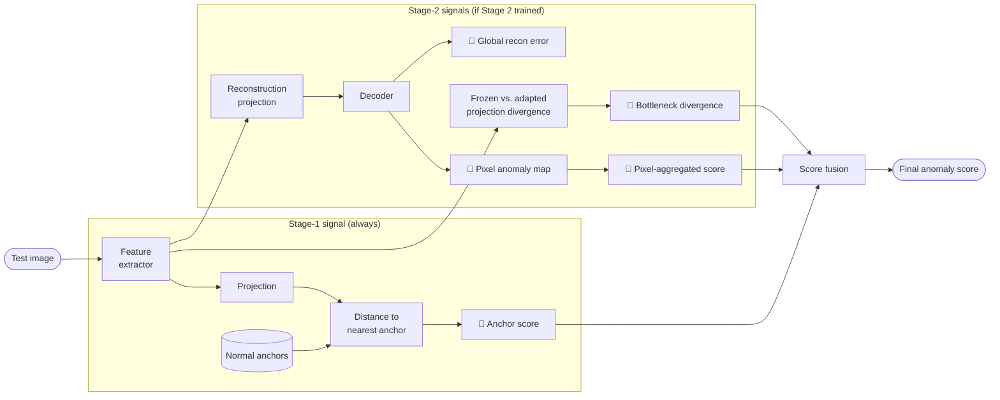

### 5.2 Stage-1 Only Inference

<details>
<summary>Implementation-level diagram</summary>

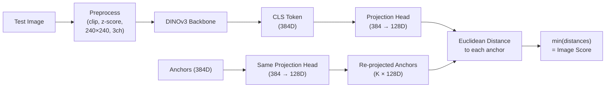

</details>

**Anchor source at inference:** The same 384D semantic anchor embeddings that were generated before Stage-1 training. They are stored as a buffer inside the model checkpoint. At inference, they are **re-projected through the same projection head** that was trained — so anchor positions in 128D reflect the *trained* projection head state, not the initial random one.

**Scoring:** The image-level anomaly score is simply the **minimum Euclidean distance** from the test sample's 128D embedding to any of the K re-projected anchors. Normal images score close to 0; anomalous images score higher.

### 5.3 Stage-2 Inference (Full Pipeline) — Implementation Detail

When a Stage-2 model is loaded, multiple scoring signals are computed simultaneously:

<details>
<summary>Implementation-level diagram</summary>

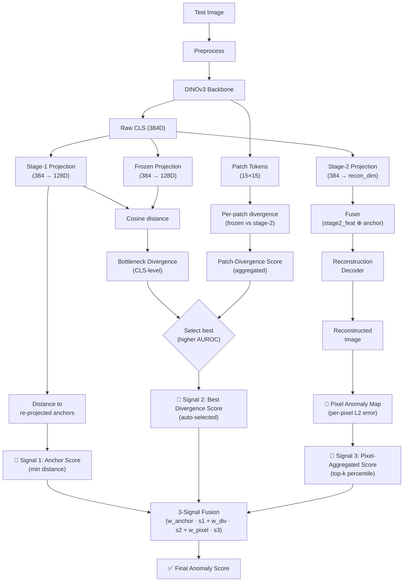

</details>

### 5.4 Which Anchors Are Used at Inference?

This is a common point of confusion. The answer:

> **The same 384D anchors generated before Stage 1 are used throughout.** 
> There are no separate "Stage-2 anchors."

The anchors are stored as a fixed buffer (`anchor_global_raw`) inside the `AnomalyDetector`. When computing anomaly scores:

1. The raw 384D anchor embeddings are loaded from the model checkpoint.
2. They are re-projected through the **current** projection head (whichever model is loaded — Stage-1 or Stage-2).
3. Distances are computed in the projected space (128D).

In a Stage-2 model, the Stage-1 projection head is **frozen** — so the anchor re-projection produces the same 128D positions as at the end of Stage-1 training.

### 5.5 Anomaly Signal Summary

Four intermediate signals are computed, but only **three** enter the final fusion. The two divergence variants (bottleneck and patch) are mutually exclusive — only the one with the higher AUROC on the evaluation set is selected.

| Signal | Source | Resolution | Role in fusion |
|--------|--------|-----------|----------------|
| **Anchor score** | Min distance to re-projected anchors (128D) | Image-level | Signal 1 (always) |
| **Bottleneck divergence** | Cosine distance: frozen vs. stage-2 projection (CLS) | Image-level | Signal 2 — selected if AUROC ≥ patch divergence |
| **Patch divergence** | Per-patch (15×15) divergence, aggregated via top-k | Image-level | Signal 2 — selected if AUROC > bottleneck divergence |
| **Pixel anomaly map** | Per-pixel L2 reconstruction error | Pixel-level (240×240) | Intermediate only |
| **Pixel-aggregated score** | Top-k percentile of pixel anomaly map | Image-level | Signal 3 (always, Stage 2) |
| **Reconstruction score** | MSE between input and reconstructed image | Image-level | Not fused — diagnostic only |
| **3-signal fusion** | Normalised weighted sum: Signal 1 + Signal 2 + Signal 3 | Image-level | Final score |

---

## 6. Post-Processing

### 6.1 Score Normalisation (for fusion)

When fusing multiple signals, each signal is normalised independently before weighting:

| Mode | Formula | When to use |
|------|---------|-------------|
| `minmax` | $(x - \min) / (\max - \min)$ | Default; works well when score distributions are unimodal |
| `zscore` | $(x - \mu) / \sigma$ | When distributions are approximately Gaussian |
| `robust` | $(x - q_{50}) / (q_{75} - q_{25})$ | When outliers may distort min/max |
| `rank` | $\text{rank}(x) / N$ | Non-parametric; robust to any distribution shape |

### 6.2 Three-Signal Fusion

$$\text{score}_{\text{fused}} = w_a \cdot \hat{s}_{\text{anchor}} + w_d \cdot \hat{s}_{\text{divergence}} + w_p \cdot \hat{s}_{\text{pixel}}$$

Where $\hat{s}$ denotes the normalised signal. Default weights from grid search: $w_a = 0.72$, $w_d = 0.16$, $w_p = 0.12$.

**Anti-correlation guard:** If any signal produces AUROC < 0.5 on the evaluation set (meaning it is anti-correlated with true anomalies), it is **dropped** from the fusion and the remaining weights are re-normalised.

**Divergence signal selection:** When both CLS-level bottleneck divergence and patch-level divergence are available, the system automatically selects whichever has the **higher individual AUROC** on the evaluation data.

### 6.3 Pixel Map Post-Processing

1. **Upsampling:** The reconstruction decoder outputs at 240×240 by design. If the ground-truth masks have different dimensions (e.g. 256×256), pixel scores are **bilinearly interpolated** to match.
2. **Top-k percentile aggregation:** To convert a pixel-level anomaly map into an image-level score, the map values are sorted and the **top-k percentile** (default: 95th) is taken as the aggregated image score. This captures localised anomalies without being dominated by the healthy background.

### 6.4 Bootstrap Confidence Intervals

Image-level AUROC and AUPR are reported with **bootstrap 95% confidence intervals** (default: 1000 bootstrap samples). The evaluation outputs include the mean, lower, and upper bounds.

### 6.5 Evaluation Artifacts

| Artifact | Description |
|----------|-------------|
| `evaluation_metrics.json` | All AUROC / AUPR metrics, confidence intervals, operating points (at target FPR rates) |
| `evaluation_image_scores.csv` | Per-image: file path, ground-truth label, anomaly score, assigned anchor |
| `roc_curve.png` | ROC curve with AUROC value |
| `score_distributions.png` | Histogram of anomaly scores for normal vs. anomalous images |
| Pixel-level visualisations | Anomaly maps overlaid on input images (for Stage-2 models) |

---

## 7. Anchor Modes (Alternatives)

The primary pipeline described above uses the **regfix/reproject** approach. Two alternative modes exist:

### 7.1 Decoupled / Expert Approach

Instead of re-projecting anchors, this mode creates **two separate anchor sets**:

- **Semantic anchors (384D):** K-means centroids in DINOv3 space. Used **only** for pseudo-label assignment (which samples belong to which anchor). These are completely frozen.
- **Geometric targets (128D):** Random orthogonal vectors in the projected space. These are the **actual training targets** — the projection head learns to map each sample to its assigned geometric target.

**Advantages:** No moving-target problem (geometric targets are fixed), inherently stable, no collapse risk.  
**Disadvantage:** Geometric targets are semantically arbitrary (random vectors), creating a disconnect between label assignment and training targets.

Configuration: set `geometric_init: random_orthogonal` and `freeze_backbone: true`.

### 7.2 Learnable Anchors

Anchor embeddings are `nn.Parameter`s optimised jointly with the projection head. Uses a CAM loss variant (or InfoNCE / hybrid) that includes a two-way pull term (samples *and* anchors move toward each other).

This mode supports dynamic pseudo-label reassignment every N epochs, allowing cluster assignments to evolve as the embedding space changes.

Configuration: set `learnable: true` in the anchor config section.

---

## End-to-End Pipeline Summary

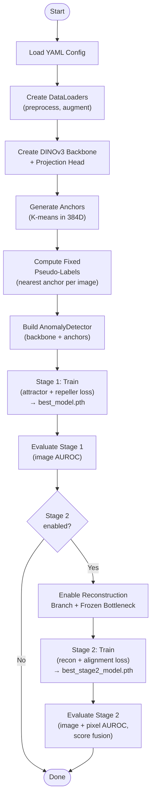
